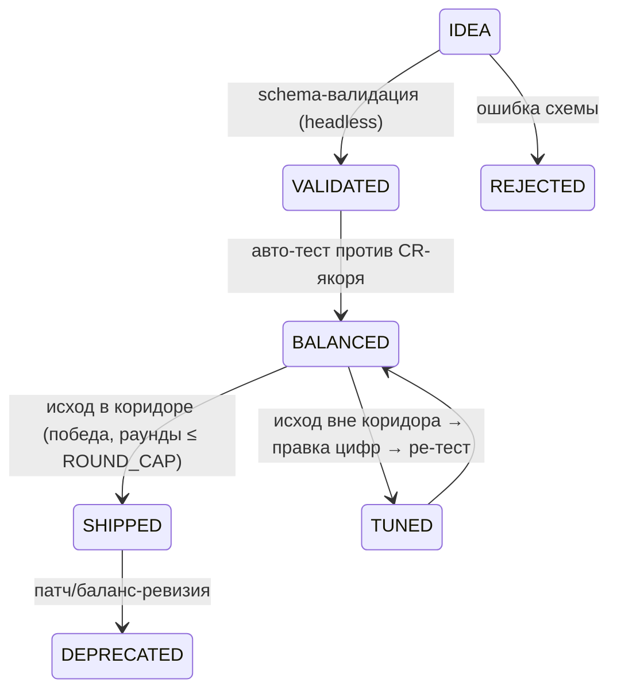

## Контент-пайплайн

**Принцип (канон 16.2):** весь контент — данные; новое здание/юнит не требует правки кода.

## Шаблон карточки (JSON, референс: data-driven HoMM3/AoE2)

```json
// building.json
{
  "id": "forge_01",
  "name": "Кузница",
  "tags": ["снаряжение", "производство"],
  "terrain_preference": ["равнина", "горы"],
  "race_affinity": {"орки": 1.2, "люди": 1.0, "эльфы": 0.9},
  "base_output": {"оружие": 2},
  "daily_inputs": {"железо": 1, "дерево": 0.5},
  "network_roles": ["снаряжение"],
  "adjacency_rules": {"с_лесом": {"бонус": 0.15}},
  "upkeep": 0,
  "vulnerability": 0.3,
  "build_time_days": 1.0,
  "cost": {"камень": 20, "дерево": 10}
}
```

```json
// unit.json
{
  "id": "unit_fighter",
  "name": "Мечник",
  "dnd_class": "fighter",
  "dnd_race": "люди",
  "hit_dice": "1d10",
  "ac": 18,
  "stats": {"STR": 15, "DEX": 10, "CON": 14, "INT": 10, "WIS": 12, "CHA": 10},
  "luck": 12,
  "abilities": ["боевая_тренировка", "второе_дыхание"],
  "resource_cost": {"еда": 20, "оружие": 10},
  "train_time_days": 0.6,
  "required_network_roles": ["рекруты", "обучение", "снабжение", "снаряжение", "командование"],
  "morale_profile": "standard",
  "xp_cr_anchor": 1
}
```

`stats` — 6 характеристик + `luck` (7-я, Удача, 02d v1.2), мод = floor((стат−10)/2); эффективные характеристики — производные (антагонизм, 02d v1.1, `recalculate_all()`); наём/создание — гейт класса по минимумам (02d §4.2, K1: 11 классов, Колдуна нет); `key_feature` (ключевой признак класса), `skills` (18 навыков, ранги 0–3, 02d §5).

Остальные типы (район, узел карты, знак) — поля по таблице 02-mechanics; у района обязательны `upkeep` + `vulnerability`, у юнита — `required_network_roles` + `hit_dice`.

```json
// binom.json (02b-binoms-terrain, блок A)
{
  "id": "binom_flank",
  "name": "Фланг",
  "classes": ["fighter", "ranger"],
  "activation": "both_in_party_and_alive",
  "effect_type": "combo | ability | rule_change",
  "effect": {"trigger": "member_attack_hit", "applies_to": "other_member_next_attack_same_target", "value": "+2", "duration": "1 round", "per_round": 1},
  "scope": "mvp | 1.0"
}
```

```json
// sign.json (02c-signs)
{
  "id": "sign_spark",
  "name": "Искра",
  "scope": "mvp",
  "ranks": ["Первая Вспышка", "Подмастерье Импульса", "Инженер-Испытатель", "Архитектор Скорости", "Сердце Кузницы", "Аватар Искры"],
  "faction_actions": [
    {"id": "spark_3_actions", "prestige": 12, "trigger": "3+ действия за один ход"}
  ],
  "trial": {"name": "Перегрузка разума", "goals": ["3 победы", "10 раз по 3+ действия за ход", "30 прямого урона"], "reward": 250}
}
```
sign.json: `ranks` — ровно 6 имён, `faction_actions[].prestige` — целое ≠ 0; `scope: mvp` — только 3 знака (Время/Тень/Основа, S1 решено); `trial` — 1.0 (MVP — Post-MVP).

```json
// terrain.json (02b-binoms-terrain, блок B)
{
  "id": "terrain_swamp",
  "name": "Болото",
  "speed_mult": 0.5,
  "on_enter": null,
  "per_turn": null,
  "ac_flat": 0,
  "attack_flat": 0,
  "ranged_penalty": {"from": false, "against": false},
  "air": "immune | passable | storm",
  "passable_air": true,
  "fail_state": null,
  "forced_move": false,
  "scope": "mvp | 1.0"
}
```

У бинама обязательны `classes` (2 различных класса) + `effect_type` (плоский бафф валидацией REJECT — тест «бином или бафф», 02b A.1); у местности — `speed_mult` ∈ [0.5; 1] + `passable_air`.

## Пайплайн (SM карточки)



**Авто-тест баланса (pseudocode):**
```
def balance_test(unit, phase_anchor):
    # Без RNG (02d v1.2): исход определяется вводными, флэйков нет
    battle = Battle(grid=8x8, units=[unit, enemy(phase_anchor.cr)])
    outcome = auto_simulate(battle, ai="greedy")
    return "OK" if outcome.victory and outcome.rounds <= ROUND_CAP[phase_anchor.cr] else "FLAG"
```
Коридор (детерминированный аналог старого win-rate 40–70%): юнит побеждает якорь своей фазы (06-economy) и раундов до победы ≤ `ROUND_CAP[CR]` — выше = юнит «сливки», проигрыш = «мусор». `ROUND_CAP` на CR-якорях — [К ЮНИТУ: установить при первом баланс-прогоне T16]. Детерминизм: идентичные вводные → идентичный исход (02d v1.2 §8.3 #14).

**Объёмы:**
- **MVP (канон 18.1 + пивот):** 15 зданий, 5 юнитов, 3 района, 3 культуры, 3 биома, 1 город, 5–8 узлов карты, 3 знака, 1 кампания (21 ход).
- **Полный релиз [ПРЕДЛОЖЕНИЕ]:** 7 групп / 54 расы (9.4), 8 знаков (11.2), 6 биомов (4.2 «позже»), 6 мега-комплексов (8.4 банк), 3 кампании (по знаку).

**Процесс:** 1 карточка = 1 PR; ревью ≤15 мин (чек-лист: схема, CR-якор, расовые коэффициенты, upkeep); валидация — `godot --headless --script validate_cards.gd` (08-tech).

**EC:**
1. **Карточка с неизвестным тегом** (вне 19 тегов, 6.2) → валидация REJECT (закрытый набор тегов; новый тег = отдельное решение дизайнера, не опечатка).
2. **Юнит требует network_role здания, которого нет в MVP** → валидация REJECT (целостность ссылок: роли ⊆ ролей MVP-зданий).
3. **Два здания с одинаковым `id`** или дубликаты `id` в разных файлах → валидация REJECT (id глобально уникальны).
4. **Карточка прошла валидацию, но авто-тест упал (crash движка)** → карточка не SHIPPED, баг движка в трекер (валидация ≠ гарантия работы).

**Инварианты:** лимиты MVP жёсткие (18.1); маппинг 54 рас на группы — v0.1, корректируется (9.4); генератор имён фракций — из банка 002 (9.5).
