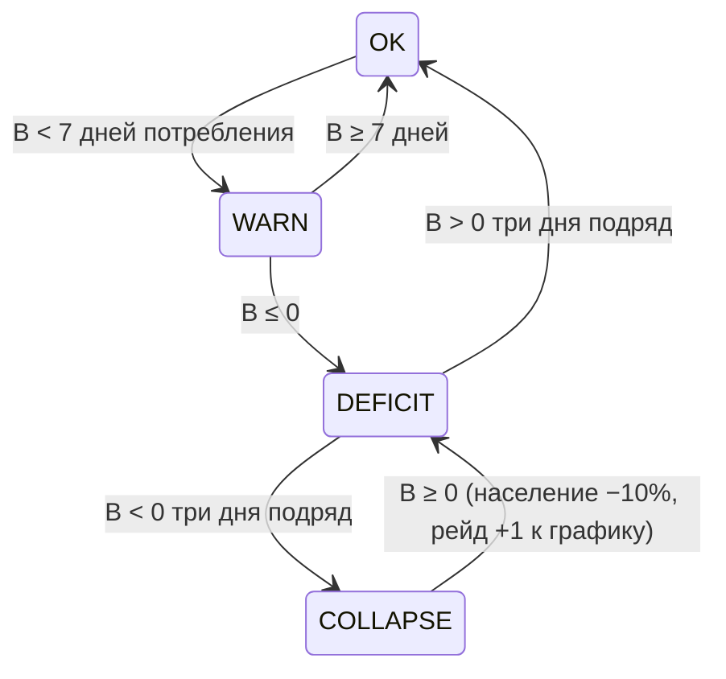

## Экономика и баланс

**Потоки:** город производит 5 ресурсов (канон 5.1: еда/дерево/камень/железо/оружие) → тратит на: обслуживание районов (8.3), наём (02-mechanics §3.3), снабжение партии (1 еда/день/юнит, 12.5). Небесные метрики (5.2) не складываются — исключение из замкнутости, декларировано.

## Таблица источников/стоков (sources & sinks)

| Ресурс | Источники (sources) | Стоки (sinks) | Сток-одиноразовый? |
|---|---|---|---|
| Еда | фермы (2–3 шт. MVP), огороды | население (`k_pop × pop`/день), партия (1/день/юнит), upkeep Аграрного двора (+2/день), наём (10–35), зимний дефицит (фермы −20%) | нет — постоянный сток |
| Дерево | лесопилка, лесной дозор (район) | постройка (одноразово: cost зданий), наём лучника/следопыта (15), upkeep Лесного дозора (+3/день) | да (постройка) + постоянный |
| Камень | каменоломня | постройка (одноразово), стены/башни (оборона 12.4) | да (постройка) |
| Железо | шахта + кузница (переработка) | производство оружия (постоянно), наём (одноразово через оружие) |двухзвенный: железо → оружие |
| Оружие (готовое) | кузница (из железа) | наём (10–18), upkeep Военного квартала (+2/день), восстановление снаряжения после рейда | да (наём) |

**Исключение — карта (Y4):** узлы дают one-time лут (таблица в 02-mechanics §3.1): конечный одноразовый источник (4–8 узлов, по 1 разу), не создаёт инфляции и не входит в таблицу источников/стоков как непрерывный поток.

**Проверка замкнутости (4 правила):**
1. **У каждого ресурса есть ≥1 постоянный сток** (иначе инфляция-складирование): еда — население/партия; дерево — upkeep+постройка; камень — постройка (до 15 зданий MVP = конечный, но после — только стены); железо — переработка в оружие; оружие — upkeep+наём. ✅
2. **У каждого стока есть источник** (никаких «нужно 100 чего-то, что не произвести»): все costs наёмных юнитов ⊆ производимого. ✅
3. **Нет дублирующих ресурсов** (еда ≠ дерево; железо и оружие — два звена одной цепи, не два ресурса-близнеца: железо без кузницы бесполезно, оружие без железа не воспроизводимо). ✅
4. **Баланс к ходу 21:** еда ≈ 0 (ровно в натяг), остальные ≥ 0 (06: якоря ниже). ✅

**Формулы:**
```
production(r) = Σ_zдания output_z × clamp(эффективность, 0.2, 2.5) × race_affinity × season
consumption(r) = k_pop(r) × population + army_size × unit_eat + Σ_upkeep(районы)
B(r, t) = B(r, t−1) + production(r) − consumption(r)
population = min(жильё, продовольствие/неделю)
```
- `k_pop(еда) = 0.1/день` [ПРЕДЛОЖЕНИЕ P-8: базовое значение, тюнинг на прототипе]; остальные ресурсы для населения = 0.
- Продажа здания: возврат 50% стоимости (анти-эксплойт «продал-купил», 02-mechanics §3.3 EC2).

## SM дефицита (per resource)


Последствия: WARN — жёлтый индикатор + хроника; DEFICIT — настроение/мораль −, производство 25% (12.2); COLLAPSE — население −10%, внеплановый рейд (кап 30%/день, 02-mechanics §3.8).

## Четыре рычага (канон Часть 17) — без изменений

1. Убывающая доходность районов: 25/18/12/7/3 % (8.5).
2. Обслуживание: Аграрный двор +2 еда/день; Военный квартал +5 еды и +2 оружия/день; Лесной дозор +3 дерева/день (8.3).
3. Уязвимость: район = приоритет рейда (+15% для Военного квартала, 8.3); разрушение → destruction_penalty (−25% военное производство / −30% разведка).
4. Культурное напряжение: конфликт застройки (6.2 штрафы) лечится сервисами (таверна, храм — 7.2).

## Якоря баланса кампании (таблица для тюнинга)

| Ход | Событие | Экономический якорь |
|---|---|---|
| 1–6 | выживание | еда в дефиците: фермы 2–3 против населения старта |
| 7 | лёгкий рейд (еда) | запасы еды ≤ 50% после рейда — норма |
| 10 | средний (железо) | игрок должен иметь кузницу, иначе провал фазы |
| 14 | средний (оружие) | проверка Военного квартала |
| 17 | сильный (район) | проверка уязвимости: один район должен быть в опасности |
| 21 | крупный (вся сеть) | победа возможна только при полной сети (все 5 ролей 12.1) |

**CR-якоря врагов карты [ПРЕДЛОЖЕНИЕ P-2]:** фаза 1 (ходы 1–6) — CR ¼–1; фаза 2 (7–13) — CR 1–2; фаза 3 (14–20) — CR 2–4; ход 21 — босс CR 6–8 (партия 4–5 персонажей 3–5 уровней).

## Экономические инварианты (что должно сходиться всегда)

- производство еды ≥ потребление (население + партия + upkeep районов) — иначе SM дефицита;
- лимит армии: 10 + командование×3 + районы×2 (12.5);
- эффективность зданий clamp [0.2; 2.5] (6.3);
- к ходу 21 суммарная сила обороны (12.1) ≥ сила крупного рейда при полной сети и < силы рейда при любой сломанной роли — «проверка всей сети» (3.1).

**EC (системные):**
1. **Игрок складировщик** (копит всё, не нанимает, не строит) → инфляции нет (ресурсы не плодятся), но видимость = 1 (мин.) → рейды слабые; стагнация безопасна, но к ходу 21 сеть неполная → крупный рейд проигран по инварианту. Экономика сама наказывает бездействие финалом.
2. **Игрок сносит всё и перестраивает** (cash-out) → возврат 50% < стоимость: перестройка стоит дороже; двойная постройка невозможна (1 клетка = 1 здание).
3. **Рейд во время DEFICIT** → последствия ×1.5 (сложное), но кап 30%/день и COLLAPSE-кап не дают снежкока; хроника объясняет: «пришли, когда вам было хуже всего».

#open-question: точные N тиков/день (Q6) и k_pop (P-8) — на бумажный прототип.

## Балансировочные рычаги (17, перенос из GDD.md v2.1) [КАНОН]

1. **Убывающая доходность** — одинаковые районы не складываются линейно ([[02e-city#8.5. Убывающая доходность [КАНОН]|02e 8.5]]).
2. **Обслуживание районов** — район потребляет еду, материалы, рабочих, мораль, безопасность. Большой район — обязательства, а не только бафф.
3. **Уязвимость** — крупный район легче обнаружить, дороже восстанавливать, при разрушении отключает несколько узлов, приоритетная цель рейдов. Выбор игрока: централизация (мощно, рискованно) vs децентрализация (слабее, устойчивее).
4. **Культурное напряжение** — конфликт культур и типов застройки (военный орочий квартал у эльфийского святилища → unrest). Сервисы лечат: таверна, храм, рынок, баня, общее собрание, праздник.

*Источник: 005§36*
