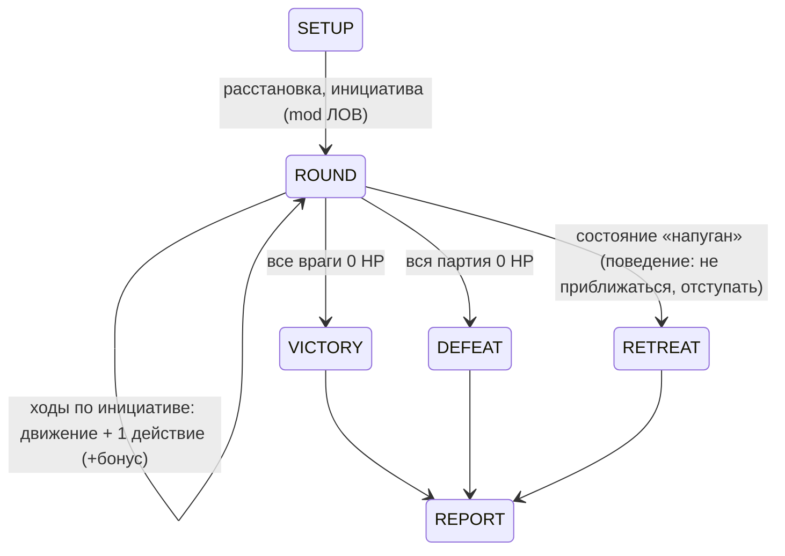
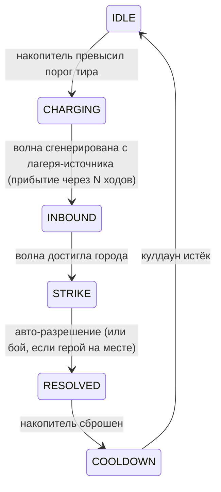

## Механики и системы

Пост-пивотный набор. Статус каждой: ПЕРЕНОС / ПЕРЕДЕЛКА / НОВОЕ / БАНК. Формат спецификации: **SM** — таблица состояний/переходов, **FS** — fail-states, **EC** — edge cases (≥3), формулы/pseudocode.

Референсы (research, офлайн): D&D 5e SRD (боёвка), HoMM3 (карта, наём, стэки), Battle Brothers (мораль, перманентная смерть), XCOM (точки действий, туман), AoE2 (наём из населения), AtS (ауры, слухи), TerraScape (биомы, стройка).

### 3.1 Карта и герой — ПЕРЕДЕЛКА (канон: Часть 4)

- **Сущности:** `Регион(id, биом, город?, узлы?)`, `Рёбро(от, до, cost, брод?)`, `Узел_карты(id, type, cr, loot)` (узел = атрибут региона, K-T7 Ф5а), `Герой(регион, движение, партия)`.
- **Правила:** карта = граф регионов G(V,E) (K-T7, 2026-10-02): базовая кампания — фиксированный граф 40–48 регионов (MAP-1); MVP = связное подмножество 5–8 регионов (MVP-маска, K-R4). Биомы (4.2: 2 регулярных + босс-биом, K-M2); 1 стартовый регион ([[MVP-scope]]). Спека — [[02e1-map#4.6. Карта = граф регионов (K-T7, 2026-10-02) [КАНОН]]].
- **Земной шар (Q18, предыгровой):** до хода 1 игрок смотрит земной шар — открытый мир с множеством регионов и городов (K-T7: земной шар = граф регионов целиком, с планетарным замыканием). Города — сколько угодно; за каждый город **после второго** — **возрастающий штраф оккупации** (кривая — TBD, баланс). Поток: [[00-overview#Предыгровой поток (Q18) [КАНОН, автор 2026-10-02]]].
- **Узлы [ПРЕДЛОЖЕНИЕ P-6]:** 1 город игрока, 5 узлов (руины/руды/лагерь), 2–3 нейтральных поселения. Туман: неизведанные регионы не видны; радиус — TBD (K-T7, Ф3).
- **Добыча узлов (one-time, Y4):** руины: 10 дерева + 5 железа + 300–500 XP; руда: 20 железа + 300 XP; лагерь: 5 еды + 10 железа + 400–600 XP (по CR). Карта — конечный одноразовый источник, не ломает замкнутость экономики (06).
- **NPC-поселения (1.0, Y9):** две интеракции: **атака** (рейдишь поселение: добыча + оно становится враждебным) или **союз** (выполняешь их квест — одно действие на карте: +репутация, они не рейдят тебя, слухи дают их координаты). Третьего состояния нет (MVP: поселения — Post-MVP).
- **Движение:** стоимость входа в регион (по биому, config) + шаги внутри региона; лимит шагов/день [ПРЕДЛОЖЕНИЕ P-5]; дороги — снижение cost рёбер (×2 скорость). **Формула движения (автор, 2026-10-02, D4):** скорость рассчитывается от местности (бинома), по которому идут, + Ловкости + веса персонажа (инвентарь и экипировка); фиксированные «6/10 очков» отменяются. **K-M4 (2026-10-02): формула ратифицирована**; числа — баланс-конфиг (создаётся в Ф4: 2 регулярных биома + столбцы-заготовки, единая схема K-R2); инвариант доходимости якорей 7/14/21 (контроль — автобалансировщик).
- **Дороги (1.0, Y5, Post-MVP):** строит игрок с экрана карты: 1 ребро = 1 сегмент, 5 дерева, без таймера (мгновенно). Дорога — не здание: не занимает регион, разрушается рейдом с вероятностью 0.25.

**SM героя:**

| Состояние | Переход | Условие |
|---|---|---|
| EXPLORE | → ENGAGE | враг в radius 1 (авто-детект, уведомление) |
| ENGAGE | → BATTLE | игрок подтвердил; если игрок 2 дня не выбирает (бой/обход) — авто-режим (авто-бой) |
| ENGAGE | → EXPLORE | обход: существует путь до клетки, не смежной с врагом |
| BATTLE | → VICTORY / DEFEAT | правила боя §3.4 |
| DEFEAT | → RETREAT | авто-возврат в город за 1 день (по пути новых боёв нет, Y10), раненые остаются |
| RETREAT | → EXPLORE | герой в городе, партия ≥1 живого (REST) |

**FS:**
- все персонажи пали в бою → **поражение кампании** (экран итога, сейв сохранён, Престиж знака переносится, 03-progression). Softlock невозможен: DEFEAT всегда разрешается в RETREAT или END.
- движение = 0 в поле (без дороги) → ход героя заканчивается на текущей клетке (не softlock: фазы города доступны всегда).
- окружение (нет пути обхода) → ENGAGE обязателен, обход заблокирован (UI показывает почему).

**EC:**
1. **Игрок хочет обход, но все пути перекрыты врагами** → правило обхода формально: путь до клетки, не смежной с врагом; нет пути → ENGAGE или отход назад (движение назад стоит движение).
2. **Рейд приходит на клетку с героем** → бой с рейдом вместо авто-разрешения; при победе последствия рейда −50% (06-economy), при провале — полные + раненые.
3. **Герой в бою, а город под рейдом** → рейд разрешается без партии: защита = здания (канон 13.3: стены/башни = модификатор защиты), последствия по §3.8.

### 3.2 Партия и персонажи — НОВОЕ

- **Сущности:** `Персонаж(класс, раса, уровень, статы[6]+УДЧ, prof, ac, hit_dice, способности, состояние)`. Партия ≤5.
- **Попутчики (Q18):** члены партии **тренируются, а не нанимаются** — город = база тренировки команды (предыгровой поток, 00-overview). Источники юнитов: люди из города, попутчики, НПС из событий; модель наёмного рынка (§3.3) — вытеснена. Механика тренировки (стоимость, время, какие здания города отвечают) — TBD.
- **Характеристики, классы, навыки:** 6 характеристик + **Удача** (7-я, 02d v1.2), мод = floor((стат−10)/2), ключевые признаки 11 классов и гейты (13), 18 навыков (ранги 0–3), антагонизм характеристик (v1.1), петля мастерства и профессии (1.0) — [[02d-classes-skills]]. Решения K1–K3 (2026-09-30): 11 классов без Колдуна («mage» = Волшебник), d20 удалён (лестница + Удача), рост характеристик — MVP.
- **Рост характеристик (K3, MVP):** на уровне → +2 к одной или +1 к двум (5e ASI), практический потолок 16. Антагонизм (02d v1.1) — производный: эффективная характеристика = базовая − штраф (порог 16, единый `recalculate_all()`); гейты, полы навыков, моды, хиты считаются от эффективной. Петля мастерства (практика → рост) и профессии — 1.0 (в MVP крафта нет).
- **XP (упрощённый 5e):** уровни 1→5 за кампанию; пороги: 2700 / 6500 / 15000 / 38000 XP (SRD). Источники: бой (таблица по CR врага), действия (рейд пережит = 300, узел карты = 200–800); район создан = +500 **Престижа** (K-M1: XP-канал исключён — 07-balance §7).
- **Лимиты и резерв (Y1):** армия = **пул** юнитов (лимит — [[07-balance#5. Угрозы и рейды]], 12.5); **партия = 5 выбранных из пула** (выбрать/снять — 1 клик). Выбранные едят 1 еду/день в походе (снабжение, §3.4); резерв в городе ест 1 еду/день и добавляет к обороне города (+0.02 за юнита, кап +0.2). MVP: пул = партия (резерв — Post-MVP).

**SM персонажа (жизнь/смерть):**

| Состояние | Переход | Условие |
|---|---|---|
| READY | → WOUNDED | hit_dice ≤ 0 в бою (успешные death saves < 3) |
| WOUNDED | → READY | REST в городе: 1 день, лечение (2+CON) × hit dice (куб → среднее, 02d v1.2) |
| WOUNDED | → UNSTABLE | следующий бой при HD = 0 |
| UNSTABLE | → DEAD | 3 failed death saves (перевес = mod эфф. ТЕЛ < 0, старт −1) |
| UNSTABLE | → WOUNDED | 3 successful (перевес ≥ 0, старт +1) |
| DEAD | → (перманентно) | замена: наёмник того же класса, уровень = уровень города − 1, мин. 1 |

**FS:** смерть финальна для кампании (00-overview: вложение в персонажа); UI персонажа всегда показывает HD, чтобы UNSTABLE не был сюрпризом.

**EC:**
1. **Вся партия пала в одном бою** → DEFEAT кампании (FS §3.1), но сейв и Престиж сохраняются; нет «game over без возврата».
2. **Наём в походе (герой вне города)** → действие недоступно: наём только в городе (UI: «вернись в город», tooltip с причиной).
3. **Апгрейд уровня в середине боя** → применяется ПОСЛЕ боя (итоговый экран: «+уровень, новая способность»), таблица способностей не меняется под ходом.

### 3.3 Наём войск (AoE-модель) — ПЕРЕДЕЛКА (канон: 12.3, 12.5) [вытеснена Q18 для попутчиков]

> [!warning] Q18 (2026-10-02): модель наёмного рынка вытеснена
> Город = база тренировки команды: попутчики **тренируются**, а не нанимаются (00-overview, §3.2). Таблица ниже — пре-Q18 модель; пул/лимиты армии (12.5) действуют, пока не переписаны под тренировочную модель (TBD).

#### 3.3.1 Статусная модель жителей (K-A5, 2026-10-02) [КАНОН]

Один житель = один статус (без двойных ролей):

| Статус | Смысл |
|---|---|
| Child | ещё не работает; растёт в Worker |
| Worker | работает (здание/профессия, 02g §5.3) |
| Mentor | обучает рекрута (0.5 Worker-выдачи) |
| Recruit | в обучении; по завершении → Fighter |
| Fighter | в гарнизоне города (оборона) |
| Hero | один из персонажей партии (R1) |
| Party-in-field | партия в походе (не в городе) |

- **Конскрипция = вакансия:** рекрут уходит с работы — производство его здания останавливается (вакансия, не штраф).
- **Партия ≠ рабочая сила:** партия в походе, город живёт оставшимися жителями.
- **Население — непрерывная величина** (не целые слоты): статус определяет роль, население — сумма.
- **Демобилизация (Fighter → Worker) — открыта (Q-Демоб, [[DECISIONS]]):** механика необратима до решения; в MVP демобилизация не реализуется.

- **Модель:** население → рекруты; стоимость списывается сразу, время идёт в днях. Референс: AoE2 (villager-производство), HoMM3 (лимит наёмников).
- **Таблица MVP (канон 12.3):**

| Юнит (класс D&D) | Стоимость | Время | Требуемая сеть города |
|---|---|---|---|
| Ополченец (militia commoner) | 10 еды | 0.3 дня | рекруты+обучение+снабжение |
| Мечник (fighter) | 20 еды, 10 оружия | 0.6 дня | +снаряжение+командование |
| Лучник (ranger) | 15 еды, 15 дерева | 0.5 дня | обучение+снабжение+командование |
| Ветеран (fighter 5+) | 35 еды, 18 оружия | 0.9 дня | военный квартал + высокая связность |
| Следопыт (ranger, лес) | 25 еды, 15 дерева | 0.7 дня | лесной дозор + башня |

**SM рекрута:**

| Состояние | Переход | Условие |
|---|---|---|
| REQUESTED | → TRAINING | ресурсы списаны, сеть города в порядке |
| TRAINING | → READY | t_найма накоплено (в тиках: `progress += tick / (t_найма × N)`) |
| TRAINING | → PAUSED | сеть города сломана (здание разрушено/продано) или дефицит ресурсов |
| PAUSED | → TRAINING | сеть восстановлена (таймер не сбрасывается) |
| READY | → (в партии) | есть слот (≤5) |
| READY | → STANDING | партия полна: ждёт в городе, ест 1 еду/день |

**FS:** пауза ≠ отмена (инвестиция не сгорает); STANDING без слота — видимый в UI (иначе «куда пропали деньги»).

**EC:**
1. **Рейд разрушает здание во время TRAINING** → PAUSED, таймер заморожен; после ремонта — продолжение.
2. **Игрок продаёт здание, нужное для TRAINING** → то же PAUSED; возврат стоимости продажи 50% (06-economy) — эксплойт «продал-купил» не даёт бонуса.
3. **Наём при населении ниже порога** (порог = 10 жителей на юнит [ПРЕДЛОЖЕНИЕ]) → действие недоступно, tooltip: «нужно +N жителей» (население = min(жильё, продовольствие), 06-economy).

### 3.4 Бой по D&D — НОВОЕ (Q13 РЕШЁН: ручная тактика + авто-опция)

Подмножество 5e SRD. **Без кубика (K2 РЕШЁН, 02d v1.2):** d20 заменён средним значением (10); исход = перевес на лестнице исходов, Удача двигает пороги зон. Референс: Battle Brothers (тактика + мораль), XCOM (точки действий).

**SM боя:**



> **Конверсия ворот (Q-M14 → final, D-124, 2026-10-03):** правило для каждого узла-ворот: **(S)** ворота становятся поведением состояния базовой системы (производящая механика входит строкой маски); **(L)** ворота становятся детерминированным условием лестницы; ворота на ничтожной шкале — ничтожны; узел, не покрываемый (S)/(L), — красный флаг: новый вопрос, блокирующий только себя, не весь RETREAT. Применено: «мораль < 40 И failed save» → **(S)** поведение состояния «напуган» (frightened; входит с контентом страха); «TIMEOUT / forced morale check» — не переход состояний, а **правило завершения боя** → выведено из диаграммы в правила («Лимит боя», Q-M20, D-128). Отступление игрока — приказ, доступен всегда; цена — провокации при выходе из зон досягаемости (§5).

**Правила (формально):**
- **Разрешение (02d v1.2 §3.1, K-T6, 2026-10-02):** `Итог = mod(эффективная характеристика) + бонус ранга навыка + ситуативное`; `перевес = Итог − DC` (в атаке DC = AC, в проверках/спасах — DC). «10 + prof» аннулировано (K-T6): константы 10 нет, prof в формуле боя нет (prof — только порог Долга судьбы, 02d §4.2); DC/AC калибруются от распределения Удачи (числа — 02d, Ф3).
- **Лестница (02d v1.2 §3.2):** Триумф (перевес ≥ 4−modУДЧ, не ниже +1) / Успех (≥ 0) / Частичный (≥ −(3+modУДЧ)) / Провал / Критпровал (≤ −(8+modУДЧ)). В бою: Триумф = крит-эффект (урон ×2), Успех = полный урон, Частичный = половина урона, Провал = промах, Критпровал = фамбл (02d §3.5: застрявшее оружие / контратака).
- **Удача (02d v1.2 §4):** пул ОУ = 1 + modУДЧ, полное восстановление за длинный отдых; Сдвиг судьбы (1 ОУ: исход на ступень вверх), Спасение (2 ОУ: критпровал → провал). Долг судьбы: +1 за каждое ОУ; порог = бонус мастерства носителя, лимит единовременного заёма, штраф (значение — [[07-balance#4. Бой (указатели)]]), перенос (02d v1.2 §4.2, K-R1).
- Инициатива: `mod(эфф. ДEX)`, по убыванию; тай-брейк: эфф. ТЕЛ (HP), затем фиксированный порядок (id юнита).
- Урон: `среднее_кубов_класса + mod` (куб → среднее: d4→2, d6→3, d8→4, d10→5, d12→6); Триумф → ×2, Частичный → floor(урон/2). Щит: AC = 10 + броня + mod(DEX) (лёгкая).
- Спасбросок: `Итог = mod(эфф. хар-ка) + бонус ранга − DC`, лестница (K-T6).
- Death saves: `перевес = mod(эфф. ТЕЛ)` (без prof): ≥ 0 = success (старт +1), < 0 = fail (старт −1); 3 fail = смерть, 3 success = WOUNDED.
- Состояния: **prone** (−2 к атакам до вставания; враг в 1 клетке — +2), **frightened** (−2 к атакам/проверкам против источника вне 1 клетки), **stunned** (атаки/спасы = Провал, действие нельзя), состояния стакаются без лимита (5e).
- Снабжение (маппинг P-4, РЕШЁН): полный запас (>50% ёмкости) → +2 к первой проверке сопротивления персонажа в бою (первое спасение, наступившее в бою; лестница, K-T6; конверсия (S)/(L) — D-128); половина → 0; голод → −2 к атакам.
- **Лимит боя (Q-M20, D-128, 2026-10-03):** 20 раундов (число — [[07-balance#4. Бой (указатели)]]). По истечении лимита бой завершается ничьей: победа не присуждается (Престиж/Слава/опыт — 0), потери фиксируются, армии сохраняют состав и позиции; повторное столкновение — новый бой. Это правило завершения боя, не состояние SM (узел TIMEOUT выведен из диаграммы). Основание: детерминизм допускает конфигурации, где ни одна сторона не может поразить другую (Удача + бонус < КБ обеих) — вечный бой; лимит — детерминированная гарантия конечности (I1). T17-инвариант №3 «нет вечных боёв» (тест: две стороны со взаимно недосягаемыми параметрами → бой завершается на 20-м раунде ничьей).
- **Сигнал завершения:** `end_battle(winner, surviving_atk, surviving_def)` эмитится **после** атаки, убившей последнего юнита — после боевой анимации (`BATTLE_ATTACK_ANIM_SEC` = 0.3 c), не в момент `battle_over`; это поведение по дизайну (T-118, D-152). Потребители (отчёт/награды/возврат отряда) получают сигнал с задержкой анимации.
- **Мораль (Y2) — АННУЛИРОВАНА НАВСЕГДА (K-M11, 2026-10-03):** шкала 0–100 и формула (старт 70; поражение в бою −15, смерть товарища −10, голод −5/день, победа +5, рейд пережит +5, отдых в городе +10/день; «мораль < 40» → спас от отступления, DC — Ф3, K-T6) валидного места не имеют — состояния заменяют шкалу боевого духа (расширение — каталог состояний; формула запрещена каноном, не отложена). MVP: принудительный отход при HD 0; утрата = ступень −2 на спасброски до конца боя (R1). Текст — архив; ворота «мораль < 40» в SM-диаграмме — аннулированы (Q-M14 → final, D-124: (S) поведение состояния «напуган»; узел TIMEOUT — красный флаг, перерегистрирован как Q-M20 и закрыт: правило завершения боя «Лимит боя», не переход SM (D-128)).
- **AI врага (Y3):** стандартные враги — greedy (детерминированно: атакуют юнита с мин. HP в радиусе, при равенстве — меньший id; двигаются к ближайшей цели); босс (ход 21) — greedy + 1 способность, когда суммарный HP партии < 50%.
- **Статы врага (M1):** AC, HP, УДЧ, способности врага ВСЕГДА видны на его карточке — неизвестного врага не существует: «честный стол» требует видимого оппонента.
- **Авто-режим:** тот же движок (без RNG — детерминирован), AI-политика: атакует цель с мин. HP в радиусе; отступает в состоянии «напуган» (D-124, 2026-10-03). Один отчёт на оба режима.
- **Биномы и местность (подсистема):** [[02b-binoms-terrain]] — биномы по классам (синергии пар: MVP 1, 1.0: 8), штрафы местности поля (MVP: 3 типа, 1.0: 8), полёт (hover wizard) и телепорт (заклинание «Blink») — 1.0. Решения C1–C4 — [[02b-binoms-terrain]].

**Pseudocode атаки:**
```
def attack(att, tgt):
    total = 10 + att.mod_eff(attack_ability) + att.prof + att.situational  # местность, состояния: ±2
    margin = total - tgt.ac
    zone = ladder(margin, att.luck)          # 02d v1.2 §3.2 (Удача сдвигает пороги зон)
    if zone in (FAIL, CRIT_FAIL): return {hit: False, zone}
    dmg = att.avg_dice + att.mod(damage_ability)
    if zone == TRIUMPH: dmg *= 2
    elif zone == PARTIAL: dmg = dmg // 2
    tgt.hp -= dmg
    if tgt.hp <= 0: tgt.start_death_saves()
    return {hit: True, dmg, zone}
```

**FS:**
- **Взаимное уничтожение в одном раунде** (оба на 1 HP, инициатива убивает сначала одного, второй добивает) → VICTORY по правилу «кто последний действует» — детерминировано инициативой, без special-case.
- **Бой > 20 раундов** → лимит боя (см. «Лимит боя»): ничья, потери фиксируются, армии сохраняют состав и позиции (Q-M20, D-128).
- **Реплей:** одинаковые вводные → байт-в-байт одна и та же последовательность событий (RNG в разрешении нет; автотест: 100 прогонов, 02d v1.2 §8.3 #14).

**EC:**
1. **Отступление по команде игрока в середине раунда** → RETREAT: партия уходит с поля, позиции врага сохраняются (враг остаётся на узле, CR не меняется), добыча не начисляется, раненые — раненые.
2. **Привязанный (prone) + frightened + stunned одновременно** → стакаются (5e), UI рисует все иконки; нет «перекрывания» состояний.
3. **Голодная партия (снабжение 0) в бою с преимуществом по силе** → −2 к атакам может решить бой — это по дизайну (06-economy: игнорировать город = проигрывать сильные бои), хроника фиксирует причину.

### 3.5 Постройка (TerraScape/AtS-слой) — ПЕРЕНОС (канон: 6, 7, 8)

- **Пост-пивотное ядро слоя постройки — [[02g-city-hex]] (основная механика города)**: hex-скоринг, 23 здания, слияния, уровни города. Ниже — канон-детали, перенесённые из пре-пивота.
- Канон: 6 категорий (6.1), 19 тегов (6.2), эффективность `clamp(0.2; 2.5)` (6.3), здания (6.4: старт 5, K-M1 — «15 зданий MVP» аннулировано), race_affinity (6.5), особые выходы (6.6), ауры/связи/конфликты (7.1–7.2), районы с upkeep/уязвимостью (8.3; 7 групп, K-M1 — «3 района» аннулировано; к ходу 14 — минимум 1 здание группы, объём сверх — баланс), убывающая доходность 25/18/12/7/3 (8.5).
- **AtS-условие [ПРЕДЛОЖЕНИЕ P-3]:** `terrain_preference` — жёсткое требование: здание строится только на совместимом биоме.
- **Районы (Y6; MVP — ядро, K-M1):** эмерджентные, НЕ здание: район возникает в момент, когда требуемые теги (8.3) собрались в его radius — событие «район создан» (триггер Престижа: +500, K-M1; 07-balance §7; XP-канал исключён). Расформирование: если теги ниже порога 3 дня подряд — район снят (upkeep останавливается, destruction_penalty не применяется).
- **Рабочие (Y7):** авто-назначение: рабочие идут в самое дефицитное здание (мин. запас/7 дней). 1.0: настройка «приоритет» (перетаскивание зданий) переопределяет авто. Ручное назначение по одному рабочему — Post-MVP.

**SM здания:**

| Состояние | Переход | Условие |
|---|---|---|
| GHOST | → BUILDING | стоимость списана, биом совместим |
| BUILDING | → WORKING | t_строительства накоплено |
| BUILDING | → GHOST | рейд попал по стройке: −50% стоимости возвратом [ПРЕДЛОЖЕНИЕ P-7] |
| WORKING | → DISABLED | дефицит ресурсов: скорость производства 25% (12.2) |
| DISABLED | → WORKING | запасы > 0 |
| WORKING | → RUINED | рейд |
| RUINED | → REPAIRING | игрок начинает ремонт |
| REPAIRING | → WORKING | t_ремонта = 0.5 × t_строительства |

**FS:** постройка на несовместимом биоме невозможна (кнопка заблокирована + tooltip); 1 клетка = 1 здание (канон); аура действует только из WORKING.

**EC:**
1. **Рейд по зданию в BUILDING** → вероятность попадания ×2 (видимая цель, 06-economy); попадание → GHOST с возвратом 50%.
2. **Продажа здания с аурой** → аура исчезает мгновенно, зависимые здания пересчитываются (могут уйти в DISABLED) — UI предупреждает до подтверждения («потеряют: +15% фермы»).
3. **Район, чьи теги разбросаны по несовместимым биомам** → район не формируется: теги считаются только в radius района на совместимых клетках (8.3).

### 3.6 Расы и культуры — ПЕРЕНОС (канон: Часть 9)

- 3 культуры MVP (люди/орки/эльфы), «стиль, а не клетка», race_affinity (6.5), особые выходы (6.6), гибриды (9.3).
- **Маппинг:** раса персонажа D&D = культура (orc fighter = орочий стиль города + статы орка 5e). Одна таблица расовых коэффициентов работает и для зданий, и для персонажей.

**EC:**
1. **Гибридный город (2 культуры, 9.3)** → культурное напряжение: конфликтные пары застройки дают штраф (6.2), лечится сервисами (7.2: таверна/храм).
2. **Юнит расы, отсутствующей в городе** (эльф-лучник в орочьем городе) → работает (стиль, а не клетка), но race_affinity зданий не получает бонуса от этого персонажа — персонаж не меняет расу города.
3. **Особый выход (6.6) при 100% одной культуры** → срабатывает без условий; при гибриде — порог 70% [ПРЕДЛОЖЕНИЕ].

### 3.7 Знаки — ПЕРЕНОС (канон: [[02c-signs]], финальная редакция 2026-09-30)

- **Финальная редакция (решение автора):** карты удалены (мир = юниты/постройки/ресурсы/действия), Резонанс/Диссонанс удалены — единое число **Престиж**, растёт и падает напрямую. 8 знаков: Искра, Время, Равновесие, Первозданность, Тень, Гармония, Цикл, Основа. Контент (4 слоя, фракционные таблицы, ранги, матрица, испытания) — [[02c-signs]].
- **8 знаков**, выбор из 8 на всю игру (Q18, D12 — автор 2026-10-02); MVP берёт подмножество (набор TBD); «MVP: 3 знака» — устарело (Y8).
- **Престиж (единое число):** универсальные начисления/списания + фракционные действия (таблицы: 02c §2). Правила финальной редакции:
  1. **≤12 фракционных действий за кампанию** — фарм повторением невозможен.
  2. **Стилевой штраф только за повтор:** первое отклонение от стиля знака прощается, штрафуют второй и последующие.
  3. **Проигрыш не списывает Престиж** — наказывается поведение, не слабость.
  4. **Тактическое отступление не штрафуется** — осмысленный ход.
  5. PvP-строки (противник/эмодзи/выход из матча/эксплойт) **удалены** — мультиплеера в игре нет (S3 решено); поведенческие списания — только в фракционных таблицах (02c §2).
- **Ранги:** пороги **0 / 200 / 500 / 1000 / 2000** (5 рангов, Ф4-волна 1; титулы: «Безымянный» 0 / «Знаемый» 200 / «Почитаемый» 500 / «Славный» 1000 / «Легендарный» 2000 — канонизация владельца 2026-10-04, D-133: prestige.json). Шкала 6 рангов (0/500/1500/3500/7000/12000) **аннулирована** (K-D5/K-M16: Престиж — не XP-градиент; Ф4-волна 1; supersede одобрен владельцем 2026-10-03). Канон — 07-balance §7 / prestige.json. Падение ниже порога = понижение, косметика ранга гаснет до возврата очков. Старое правило «ранг = престиж/20 (1–5)» заменено.
- **Якорь кампании:** ход 21 = «Почитаемый» (500–999), верхняя граница — касание «Славного» (1000) (Ф4; титулы — канонизация 2026-10-04). [ПРЕДЛОЖЕНИЕ]-якорь «1000–1300» аннулирован как класс (числа без источника — прецедент Q-M16; supersede 2026-10-03).

- **Престиж чисто косметический (S2 решено):** притока населения от ранга нет; старое маппинг (P-3, +1…+8 жителей/нед) упразднено — население только от механик города (06-economy). Награда ранга = титул/косметика носителя (02c §2). «Последователи» (11.1) — нарративное понятие, без механического эффекта.
- **Испытания (Y8, 1.0; MVP — Post-MVP):** 8 испытаний (1/неделю, квест на карте). Числа (Ф4, K-M16, 2026-10-03): **40/50/60 + 50**; цепочка **200**; коридор **25–35%**. Старые числа (+250/−10, +10) — архив. Таблица — 02c §4.

**SM знака:**

| Состояние | Переход | Условие |
|---|---|---|
| DORMANT | → ACTIVE | игрок выбрал знак на старте кампании (1) |
| ACTIVE | → TRIAL | начало недели (квест на карте, 1.0) |
| TRIAL | → ACTIVE | успех: +250 престижа; провал/просрочка: −10 |
| ACTIVE (престиж ≤ 0) | → SLEEPING | бонусы и испытания выключены, знак не теряется |
| SLEEPING | → ACTIVE | престиж > 0 (успешное действие престижа) |

**FS:** носитель ≤1 знака (инвариант); передача — только смертью (11.1) — в MVP смерть носителя = конец кампании (DEFEAT §3.2); понижение ранга не ломает кампанию (косметика только, S2).

**EC:**
1. **Испытание не выполнено к концу недели** → авто-провал (−10 престижа), хроника: «знак недоволен» (04-narrative).
2. **Престиж упал до 0** → SLEEPING: не game-over, бонусы выключены, путь восстановления = обычные действия престижа.
3. **NPC-поселение на карте со своим знаком** → его испытания не пересекаются с игроком; поселение может стать целью/союзником (узел карты, §3.1).
4. **13-е фракционное действие за кампанию** → Престиж не начисляется (UI: счётчик «осталось N», правило 1).

### 3.8 Давление среды и рейды (AtS, V5) — НОВОЕ

- **График рейдов (канон 13.2):** ~~ходы 7 / 10 / 14 / 17 / 21~~ — **аннулировано (K-T5/K-R3, 2026-10-02)**: календаря рейдов нет, рейд = пересечение порога накопителя давления. Спека — [[02e4-military#13.2. Функция давления (K-T5, 2026-10-02) [КАНОН]]].
- **Сезоны (P7, Post-MVP):** весна 1–5, лето 6–10, осень 11–15, зима 16–21 (6 ходов); зима: фермы −20% производства. [Числа TBD (автор, 2026-10-02, D4): подбираются балансом после стабилизации основной системы.]
- **Видимость:** `видимость = 1 + 0.5 × (число баз − 1) + 0.2 × (уровень района)`; база = любое поселение с производством (MVP: 1 город → видимость = 1 + 0.2 × уровень района, минимум 1). Вторая база без логистики (дорога+склад) теряет 50% эффективности (4.5).

**SM рейда:**



**Разрешение (pseudocode):**
```
def resolve_raid(raid, city, hero):
    if hero.at(raid.target): return battle(raid, hero.party)  # §3.1 EC2
    target = pick(raid)  # score = 0.5*видимость + 0.3*уязвимость_цели; тай-брейк: меньший id (детерминизм, 02d v1.2)
    loss = raid.power * (1 - defense(city))  # defense: стены/башни 13.3
    clamp(loss, max=0.30 * stock(target_resource))  # кап: ≤30%/день
    city.stock[target_resource] -= loss
    if target is district: district.state = RUINED  # 8.3, destruction_penalty
    chronicle.append(raid, target, loss)
```

**FS:**
- **AFK-каскад** (3+ рейда подряд): кап 30%/день на ресурс; нет цепного коллапса (01-core-loop EC).
- **Все районы разрушены** → город жив: производство −50%, частота рейдов −50% (передышка, антифрустрация), хроника: «они отступили — выжить удалось».

**EC:**
1. **Рейд в день, когда игрок начал ремонт того же района** → ремонт не прерывается, но рейд бьёт по RUINED-району с ×0.5 (уже ослаблена цель).
2. **Герой в походе, рейд по городу, партия голодная** → защита только зданиями (13.3); последствия полные; хроника называет причину: «партия была в пути».
3. **Крупный рейд (ход 21) при сломанной роли сети (12.1)** → победа возможна только при полной сети (инвариант 06-economy): при провале — DEFEAT кампании (не game over: Престиж переносится, 03-progression).

**Зависимости:** карта → герой/партия → бой; город (постройка+расы+районы) → наём → партия → бой; знаки → население → город; давление → город и партия.
